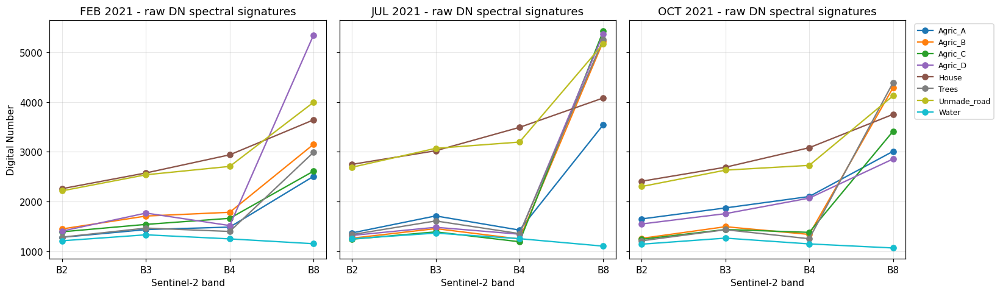
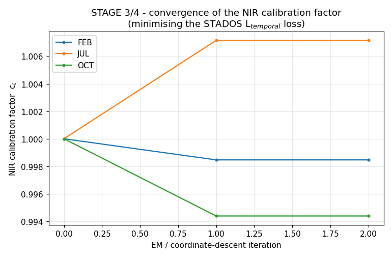
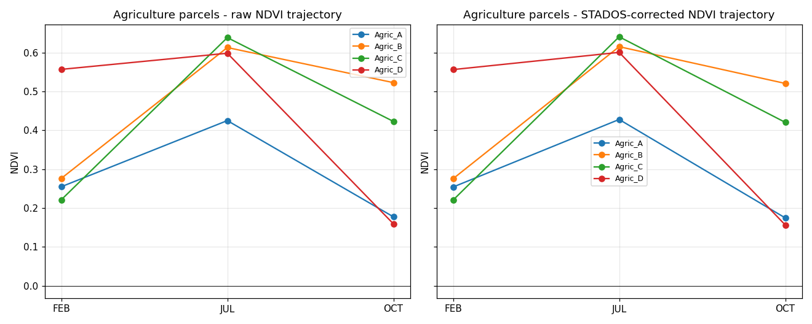
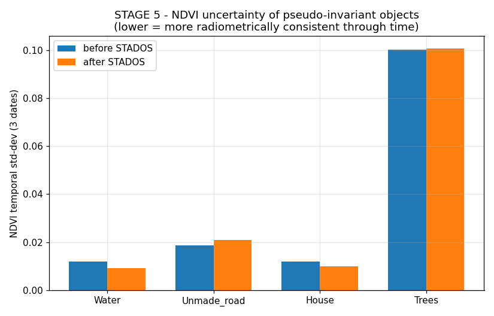
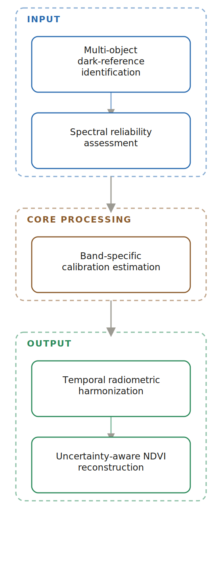

### Hi, this is a research repository by Naziru Halilu 👋

**STADOS: Spectral-Temporal Adaptive Dark Object Subtraction**

A five-stage radiometric harmonization framework that generalizes classical
single-pixel dark-object subtraction into a multi-object, reliability-weighted,
iteratively self-consistent correction for multi-temporal Sentinel-2 NDVI
monitoring, together with a complete, reproducible Python implementation.

📫 halilunaziru73@gmail.com

---

## Problem, Methodology, and Results

**Problem.** Multi-temporal vegetation monitoring from Sentinel-2 imagery depends on NDVI computed from red and near-infrared reflectance, yet raw, uncorrected NDVI drifts across acquisition dates because of date-dependent atmospheric path radiance, undermining exactly the kind of within-season trend monitoring the index is most often used for.


*Figure 4. Raw Sentinel-2 digital-number spectral signatures, illustrating the date-dependent drift STADOS corrects for.*

**Methodology.** STADOS extends classical dark-object subtraction into a five-stage framework: (1) multi-object dark-reference identification, using Water, Unmade_road and House as hard radiometric anchors while excluding Trees, whose NIR swing reflects real phenology rather than atmospheric artefact; (2) spectral reliability assessment, weighting each anchor by the inverse of its temporal coefficient of variation; (3) band-specific NIR calibration estimation; (4) temporal radiometric harmonization via an Expectation-Maximization-style coordinate-descent scheme minimizing a temporal-harmonization loss function; and (5) uncertainty-aware NDVI reconstruction. The framework was applied to a real multi-temporal Sentinel-2 dataset (February, July, October 2021) sampled over eight land-cover classes near Coimbra, Portugal, including four monitored corn parcels.


*Figure 6. Convergence of the three date-specific NIR calibration factors across iterations, reduced from 200+ non-convergent iterations to exactly 3 once renormalization was introduced.*

**Results.** The correction reduces the temporal variance of the water and rooftop reference classes by 39% and 31% respectively, preserves NDVI's exact mathematical formulation (raw-vs-corrected regression slope ≈ 1.0, R² ≥ 0.999), and propagates a small, systematic, date-dependent adjustment (0.002–0.028 NDVI units) to four monitored corn parcels' seasonal NDVI trajectories. An explicit uncertainty diagnostic further shows that a single shared calibration factor per date cannot simultaneously improve every candidate anchor, quantifying a trade-off usually left unreported in single-reference correction workflows.


*Figure 13. NDVI trajectories of the four monitored corn parcels across the growing season, raw (left) vs. STADOS-corrected (right).*


*Figure 15. NDVI temporal uncertainty (standard deviation across the three acquisition dates), before and after STADOS correction.*

**Workflow sketch**



[View interactive graphical walkthrough →](https://halilunaziru73-creator.github.io/STADOS-Spectral-Temporal-Adaptive-Dark-Object-Subtraction/)

---

## Contents

```
manuscript/            STADOS_Manuscript.docx — full manuscript with 15 figures
code/                   STADOS_analysis.ipynb, stados_analysis.py, HTML export
results_tables/         9 CSV tables produced by the analysis
figures/                15 numbered figures referenced in the manuscript
```

## How to Run the Code

```bash
pip install -r requirements.txt
python3 code/stados_analysis.py
# or, for the full notebook with commentary:
jupyter nbconvert --to notebook --execute --inplace code/STADOS_analysis.ipynb
```
